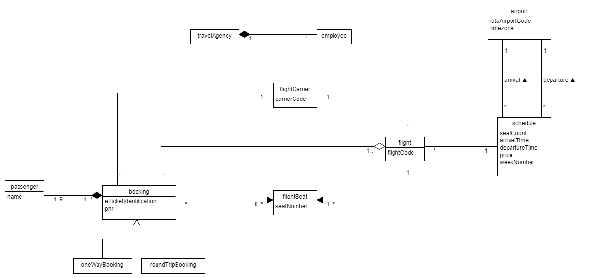
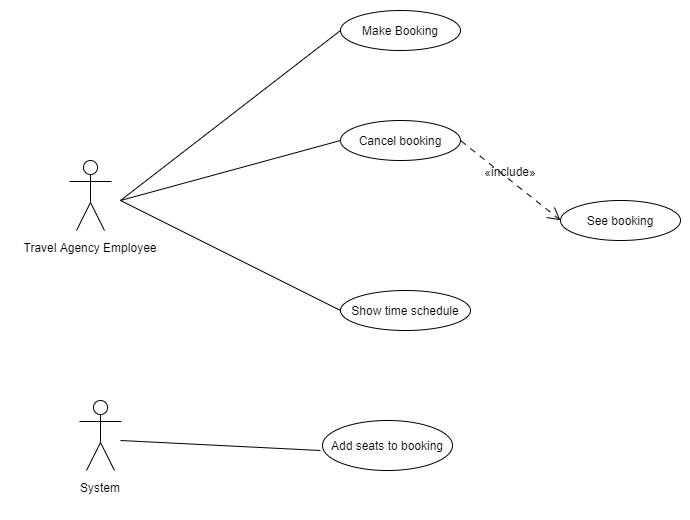

# LSD-Project

[Case 1](https://datsoftlyngby.github.io/soft2020fall/resources/e12f05a6-case-1.pdf)

-   [Assignment 1 - Logical Data Model](https://datsoftlyngby.github.io/soft2020fall/resources/535325c7-01-logical-data-model.pdf)
-   [Assignment 2 - Use Case Model](https://datsoftlyngby.github.io/soft2020fall/resources/a9edbcd7-02-use-case-model.pdf)
-   [Assignment 3 - System Operations Contract](https://datsoftlyngby.github.io/soft2020fall/resources/a3cead66-03-system-operations-contract.pdf)

## Logic Data Model

### LDM Decription

Cyan color = Not to be implemented yet.  
A **flight carrier** has 0 or more **flights** available. A flight is a trip, which is used to manage flight seats. The trip information is stored in the **Schedule**, which gets the **departure** and **arrival** informations from the **airports**.  
A **booking** is an interface for either a one-way or roundtrip, and the entity can be seen as an order, it includes the **passengers** which the **flight** is booked for.
**Flight seats** are not distributed at the time of booking, but there is an option to distribute them at a later time.  
The **travel agency** have **employees** who will the users of our system.

## Use Case Diagram

#

| Verb                                                                                                                                                      | USM |
| :-------------------------------------------------------------------------------------------------------------------------------------------------------- | :-: |
| **agreed** to **form**                                                                                                                                    |     |
| **provide** online booking                                                                                                                                |  x  |
| Schedules **has** information about                                                                                                                       |     |
| Carriers **are** identified                                                                                                                               |     |
| Flights **are** identified                                                                                                                                |     |
| Information about timezone **should be stored** for each airport                                                                                          |     |
| As a starting point, bookings **will not** include seat numbers, but they might do in the future                                                          |     |
| A booking **can involve** one or more passengers, and it **can be** a one-way booking or a round-trip booking                                             |     |
| A credit card number or frequent flyer number **should be** attached to the booking as e-ticket identification                                            |     |
| A passenger on a flight **is identified** by a Passenger Name Record (PNR)                                                                                |     |
| PNR is a unique combination of numbers from the English alphabet and numbers, there is always six alphanumeric characters and the first can’t be a number |     |
| Passenger names must **be given** exactly as stated in the passport, but in capital letters                                                               |     |
| The following tasks **should be handled** by the web application                                                                                          |     |
| **Show** a time schedule between two airports on a given day                                                                                              |  x  |
| The schedule **should** besides departure and arrival times **include** information about the carrier and number of free seats on the flights             |     |
| **Make** a booking for up to 9 persons                                                                                                                    |  x  |
| An error message **should be** returned if the seats are not available                                                                                    |  x  |
| **See** a booking, given a PNR from the booking                                                                                                           |  x  |
| **Cancel** a booking, given a PNR from the booking                                                                                                        |  x  |

## Use Case UC1: Make booking

**Primary Actor**: Travel Agency Employee (TAE)  
**Stakeholders and Interests**:

-   TAE: Wants an easy to use system, without errors, so they can book flights from multiple airline carriers for customers with ease.
-   Travel Agency: Wants a broader selection of flights to offer their customers.
-   Customer: Wants an easy way to book trips that might contain flights from multiple flight carriers.
-   Airline Carriers: Wants more exposure to their available flights.

**Preconditions:** TAE is logged in and authenticated. TAE has together with the customer, searched for ideal flights for their booking and has a list of flights.  
**Success Guarantee (Postconditions):** Booking is saved. Flight seat availability is updated. Booking confirmation is generated.  
**Main Success Scenario:**

1. TAE selects travel details
2. TAE clicks on a "make booking" button.
3. TAE enters customer personal information. This includes: e-ticket identification and email, passenger names and their addresses, phones numbers, date of birth, gender.
4. Clicks confirm order.
5. Order confirmation is sent to the customer's email.

**Extensions:**

1. All seats have already been booked when the flight is selected.A
   a. TAE informs the customer that the flight is unavailable.
2. Sebastian is unavailable
    1. TAE contacts developers to restart/fix system.
3. Customer doesnt speak englando
4. Customer tells TAE they have changed their mind about travelling.
    1. TAE cancels the process.
5. TAE enters the wrong information.  
   a. Customer can't travel because of the wrong information, and needs to be reimbursed.  
   b. Customer realises the mistake in the booking confirmation and contacts the Travel Agency to fix the mistake. 1. TAE updates the booking with the correct information.

**Special Requirements:**

-   Computer with internet access.
-   Phone
-   TAE has an account for the service.

**Technology and Data Variations List:**

**Frequency of Occurence:** Could be nearly continous.

### Sub-system Sequence Diagram UC1

