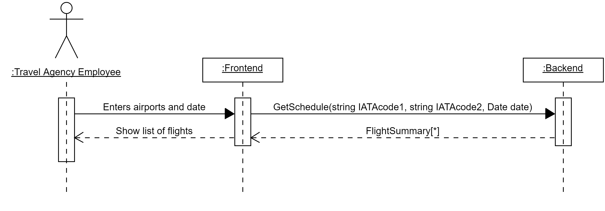

## Use Case UC2: Show time schedule

**Primary Actor**: Travel Agency Employee (TAE)

**Preconditions:** TAE is logged in and authenticated.
**Success Guarantee (Postconditions):** A list of flights between two airports on a given day is shown.  
**Main Success Scenario:**

1. TAE enters two airports, and a date.
2. TAE submits the information.
3. A list of flights between the two aiports, on the given day is shown. Information includes carrier information and number of free seats.

**Alternative flow:**  
3x. There no flights between the two aiports.  
 a. A message is shown saying that there are no flights between the two airports on the given day.
